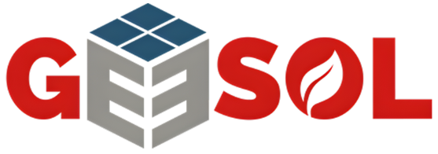

<p align="center">
  
</p>
<p align="center">
  <em>Web corporativa de GEESOL - Servicios de instalaciones fotovoltaicas, autoconsumo y soluciones energéticas.</em>
</p>

## Indice

- [Indice](#indice)
- [Vision general](#vision-general)
- [Caracteristicas principales](#caracteristicas-principales)
- [Stack tecnológico](#stack-tecnológico)
- [Estructura del proyecto](#estructura-del-proyecto)
- [Configuracion](#configuracion)
  - [Requisitos](#requisitos)
  - [Variables de entorno](#variables-de-entorno)
  - [Instalacion y ejecucion](#instalacion-y-ejecucion)
- [Testing](#testing)
- [Contribuir](#contribuir)
- [Licencia](#licencia)
- [Reconocimientos](#reconocimientos)

---

## Vision general

Este repositorio contiene la nueva web de GEESOL. La aplicacion esta construida con Next.js (App Router) y Tailwind CSS, con contenido dinamico desde Sanity, soporte multidioma con next-intl y una base SEO completa (sitemap, robots y metadatos).

---

## Caracteristicas principales

- Sitio corporativo orientado a conversion con secciones de servicios y contacto.
- Blog y contenido editorial gestionado desde Sanity.
- Internacionalizacion con rutas localizadas.
- Formularios de leads integrados con n8n.
- Integracion con Google Maps para testimonios y valoraciones.
- PWA con service worker y manifest.

---

## Stack tecnológico

- Next.js 16 (App Router) + React 19
- TypeScript
- Tailwind CSS
- next-intl para i18n
- Sanity CMS (Studio en /studio)

---

## Estructura del proyecto

```sh
geesol-web/
├── public/               # Assets publicos, manifest, robots y verificaciones
├── messages/             # Mensajes de i18n
├── src/
│   ├── app/              # Rutas y layout (App Router)
│   ├── components/       # Componentes UI y features
│   ├── contexts/         # Contextos (tema, etc.)
│   ├── i18n/             # Configuracion de locales
│   ├── lib/              # Helpers y clientes (Sanity)
│   └── utils/            # Utilidades varias
├── sanity.config.ts      # Configuracion de Sanity Studio
└── next.config.ts        # Configuracion de Next.js
```

---

## Configuracion

### Requisitos

- Node.js 18+
- npm

### Variables de entorno

Crea un archivo `.env.local` con los valores necesarios. Puedes partir de `.env.example`:

```sh
cp .env.example .env.local
```

Variables relevantes:

- `NEXT_PUBLIC_BASE_URL`
- `NEXT_PUBLIC_SANITY_PROJECT_ID`
- `NEXT_PUBLIC_SANITY_DATASET`
- `REVALIDATE_SECRET`
- `NEXT_PUBLIC_GA_ID` (si se usa Google Analytics)
- `N8N_WEBHOOK_URL` y `N8N_WEBHOOK_TOKEN`
- `GOOGLE_MAPS_API_KEY` y `GOOGLE_PLACE_ID`

### Instalacion y ejecucion

```sh
npm install
npm run dev
```

---

## Testing

Basta con probar el *linting* y la sintaxis de Typescript y JS con los siguientes comando:

```
npx eslint --ext .ts,.tsx src public --no-error-on-unmatched-pattern || true
npm run build
```

Y para comprobar el rendimiento, SEO, medidas de accesibilidad y buenas prácticas de cada página, haz:

- Primero, ejecuta la *build* de producción:
 ```sh
    cd ../frontend
    npm run build
    npm run start -- -p 3000
```

- Después, ejectuta:
```
npx lighthouse http://localhost:3000/es --form-factor=mobile --view
# Se puede probar /es, /es/services o cualquier otra ruta
```

---

##  Contribuir

- **💬 [Únete a las discusiones](https://LOCAL/Developer/ordinaly/discussions)**: Comparte tus ideas, proporciona comentarios o haz preguntas.
- **🐛 [Reportar problemas](https://LOCAL/Developer/ordinaly/issues)**: Envía errores encontrados o registra solicitudes de funciones para el proyecto `ordinaly`.
- **💡 [Enviar solicitudes de extracción](https://LOCAL/Developer/ordinaly/blob/main/CONTRIBUTING.md)**: Revisa las PR abiertas y envía tus propias PR.


<details closed>
<summary>Guías de contribución</summary>


1. **Haz un fork del repositorio**: Comienza haciendo un fork del repositorio del proyecto a tu cuenta de LOCAL.
2. **Clona localmente**: Clona el repositorio forkeado en tu máquina local usando un cliente de git.
    ```sh
    git clone /home/tu_usuario/Developer/ordinaly
    ```
3. **Crea una nueva rama**: Trabaja siempre en una nueva rama, dándole un nombre descriptivo.
    ```sh
    git checkout -b nueva-caracteristica-x
    ```
4. **Realiza tus cambios**: Desarrolla y prueba tus cambios localmente.
5. **Comprueba la build del frontend**: Antes de hacer commit, ejecuta `npm run build` en la carpeta `frontend` para asegurarte de que no hay errores de compilación.
6. **Confirma tus cambios**: Realiza el commit con un mensaje claro que describa tus actualizaciones.
    ```sh
    git commit -m 'Implementada la nueva característica x.'
    ```
7. **Envía a LOCAL**: Envía los cambios a tu repositorio forkeado.
    ```sh
    git push origin nueva-caracteristica-x
    ```
8. **Envía una solicitud de extracción**: Crea una PR contra el repositorio del proyecto original. Describe claramente los cambios y sus motivaciones.
9. **Revisión**: Una vez que tu PR sea revisada y aprobada, se fusionará en la rama principal. ¡Felicidades por tu contribución!
</details>

<!-- <details closed>
<summary>Gráfico de contribuidores</summary>
<br>
<p align="left">
   <a href="https://LOCAL{/Developer/ordinaly/}graphs/contributors">
      
   </a>
</p>
</details> -->

---

##  Licencia

Este proyecto está protegido bajo la Licencia [APACHE](https://choosealicense.com/licenses/apache-2.0/). Para más detalles, consulta el archivo [LICENSE](LICENSE).

---

##  Reconocimientos

Este proyecto fue realizado por <a href="https://github.com/antoniommff">Antonio Macías</a>.
  <br>
  Para contacto directo, puedes comunicarte conmigo a través de:
  <a href="https://www.linkedin.com/in/antoniommff/">
    
  </a>
  o
  <a href="mailto:antonio.macias@ordinaly.ai">
    
  </a>.
  <br>
  Tómate un momento para visitar mi
  <a href="http://bento.me/antoniommff">Página Personal</a> y explorar mis redes sociales.
